# Linux profile creation steps.....


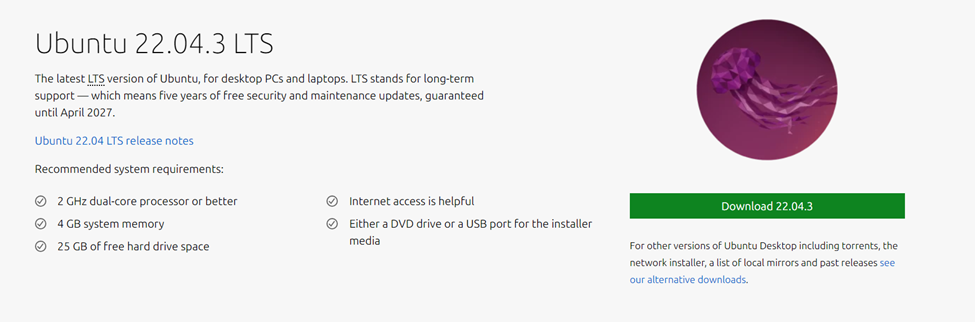


I had downloaded and installed Ubuntu 22.04.36LTS which is pretty much stable.
## Steps :
### Install Go 
sudo apt update
sudo apt install golang-go

To get the debug symbols for this OS:
### Clone the dwarf2json repository and build it
```sh
git clone https://github.com/volatilityfoundation/dwarf2json.git
```
```sh
cd dwarf2json/
```
```sh
go build
```
```sh
git clone https://github.com/volatilityfoundation/dwarf2json.git
``` 

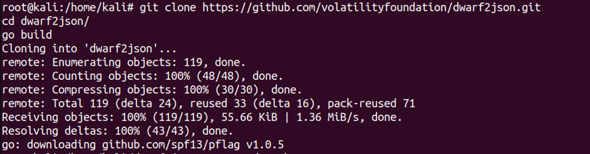


Next step: 
### Add the debug symbol repository
```sh
echo "deb http://ddebs.ubuntu.com $(lsb_release -cs) main restricted universe multiverse
```
```sh
deb http://ddebs.ubuntu.com $(lsb_release -cs)-updates main restricted universe multiverse
```
```sh
deb http://ddebs.ubuntu.com $(lsb_release -cs)-proposed main restricted universe multiverse" | \
```
```sh
sudo tee -a /etc/apt/sources.list.d/ddebs.list
```
### Install the debug symbol keyring
```sh
$ sudo apt install ubuntu-dbgsym-keyring
```

### Update the package list
```sh
$ sudo apt update
```

### Install the debug symbols for your currently running kernel
```sh
$ sudo apt install linux-image-$(uname -r)-dbgsym
```

Saving the debug symbol to json file format: 
```sh
$ sudo ./dwarf2json linux --elf /usr/lib/debug/boot/vmlinux-$(uname -r) > linux-image-$(uname -r)-amd64.json
```

As extra I am also creating system map json file:
```sh
$ sudo ./dwarf2json linux --elf /usr/lib/debug/boot/vmlinux-$(uname -r) --system-map /boot/System.map-$(uname -r) > linux-image-$(uname -r)-amd64-SystemMap.json
 ```

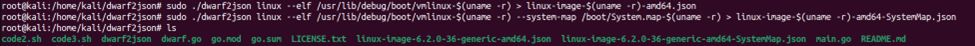


### Next Step:
```sh
$ sudo apt update
$ sudo apt install git build-essential kernel-headers-$(uname -r) dkms
```
### Download and Install Lime tool to take the dump:
```sh
$ git clone https://github.com/504ensicsLabs/LiME.git
```
```sh
$ cd LiME/src
```
```sh
$ make
```
### This command is used to create the memory dump file with the lime extension: 
```sh
$ sudo insmod /home/kali/LiME/src/lime-6.2.0-36-generic.ko path=/home/kali/memdump.lime format=lime
```

### Copying the symbol debug tables to the volatility3 symbols directory:
```sh
$ cp /home/kali/dwarf2json/linux-image-6.2.0-36-generic-amd64.json /home/kali/volatility3/volatility3/symbols/
linux-image-6.2.0-36-generic-amd64.json
```
```sh
$ cp /home/kali/dwarf2json/linux-image-6.2.0-36-generic-amd64-SystemMap.json /home/kali/volatility3/volatility3/symbols/
linux-image-6.2.0-36-generic-amd64-SystemMap.json
 ```

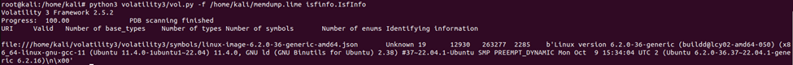


After this our linux profile is created for this ubuntu 22.04 version.


### Once Memory dump is saved as memorydump.lime in the Ubuntu system, I tested it with the volatility3 with the following commands:
* PsList: Lists active processes in the memory image.
* PsScan: Scans for processes in the memory image by walking the process list.
* PsTree: Displays active processes in a parent-child relationship tree structure.
* Banners: Identifies and prints the operating system banner information from the memory image.
* Capabilities: Lists the Linux capabilities for each process.
* Check Modules: Compares the loaded modules list against the module list obtained from sysfs.
* Check Syscall: Checks the system call table for unexpected modifications (hooks).
* Elfs: Lists ELF executables and shared libraries mapped into process address spaces.
* Envvars: Lists environment variables for each process.
* IOMem: Provides information similar to what is available in /proc/iomem on a live Linux system.
* Keyboard_Notifiers: Analyzes keyboard notifier call chains for hooks.
* KMSG: Reads the kernel log buffer messages.
* Lsmod: Lists currently loaded kernel modules.
* Lsof: Lists open file descriptors across all processes.
* Malfind: Searches for memory regions within processes that may contain injected code.
* Mountinfo: Lists mount points and mount namespaces for processes.
* Proc.Maps: Lists all memory-mapped files for each process.
* PsAux: Lists processes along with their command-line arguments.
* Sockstat: Lists network connections and sockets for each process.
* tty_check: Checks tty devices for hooks or manipulations.
* FrameworkInfo: Provides details about the Volatility framework's components and configuration.
* IsfInfo: Displays information about the available Intermediate Symbol Format (ISF) files.
* LayerWriter: Writes out the data from a specified memory layer (used for debugging and analysis).
* Check_afinfo: Verifies the operation function pointers for network protocols to check for rootkits.
* Check_creds: Looks for processes that are sharing credential structures, which could indicate credential reuse or theft.
* Check_idt: Checks the Interrupt Descriptor Table (IDT) for unexpected modifications, which could indicate rootkit activity.


### 1] PsList
```sh
$ sudo python3 vol.py -f /home/kali/memdump.lime linux.pslist
```
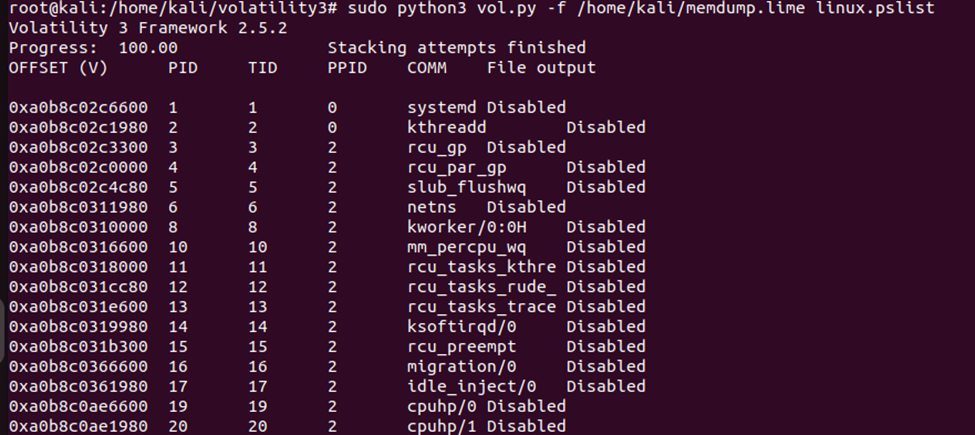
 

### 2] PsScan
```sh
$ sudo python3 vol.py -f /home/kali/memdump.lime linux.psscan
```
 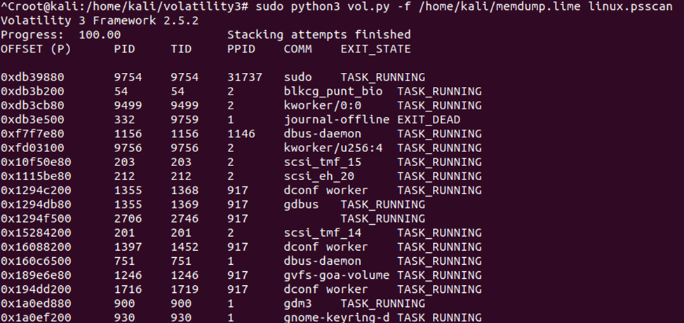


3] PsTree [Didn’t worked ]
```sh
$ sudo python3 vol.py -f /home/kali/memdump.lime linux.pstree
```
 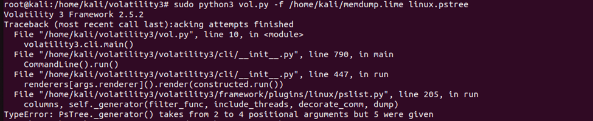

4] Banners
```sh
$ sudo python3 vol.py -f /home/kali/memdump.lime banners.Banners
```
 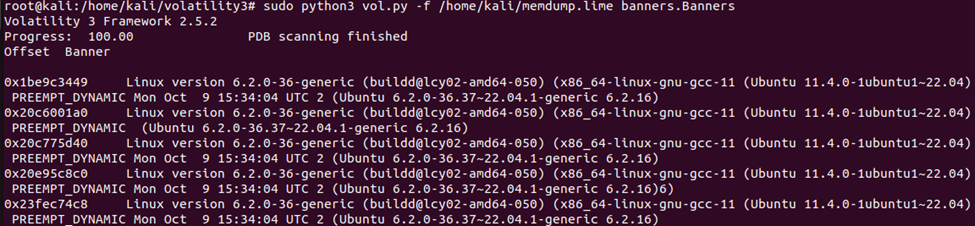

5] Capabilities [Didn’t worked]
```sh
$ sudo python3 vol.py -f /home/kali/memdump.lime linux.capabilities.Capabilities
```
 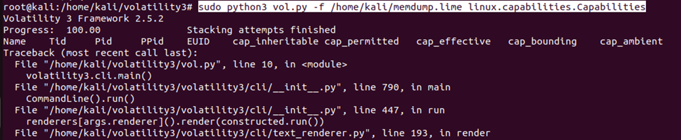

6] Check Modules
```sh
$ sudo python3 vol.py -f /home/kali/memdump.lime linux.check_modules.Check_modules
 ```

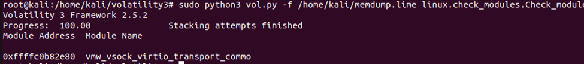


7] Check syscall
```sh
$ sudo python3 vol.py -f /home/kali/memdump.lime linux.check_syscall.Check_syscall
``` 

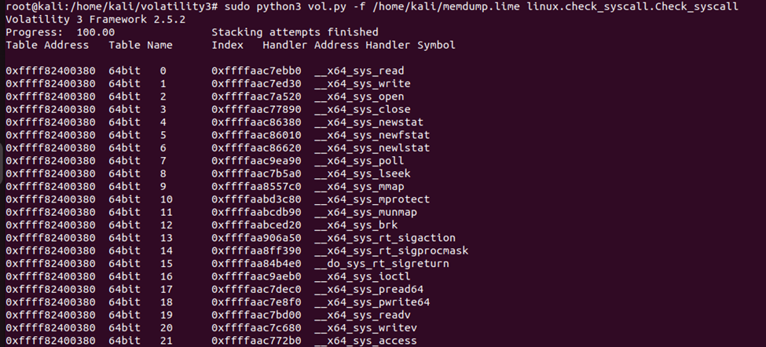

8] Elfs
```sh
$ sudo python3 vol.py -f /home/kali/memdump.lime linux.elfs.Elfs
``` 


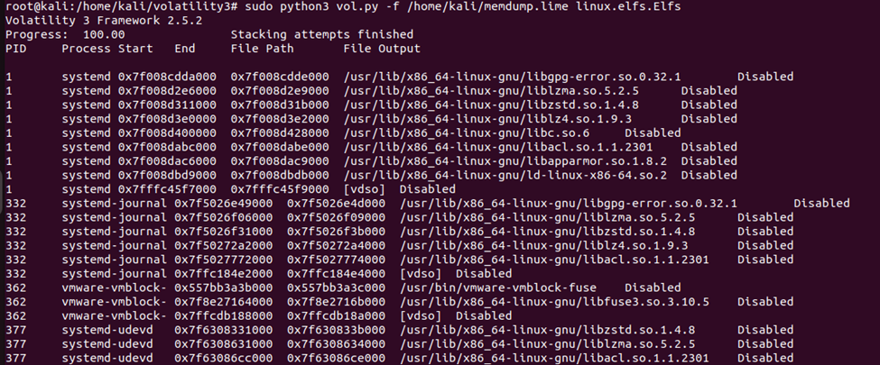


9] Envvars
```sh
$ sudo python3 vol.py -f /home/kali/memdump.lime linux.envvars.Envvars
``` 

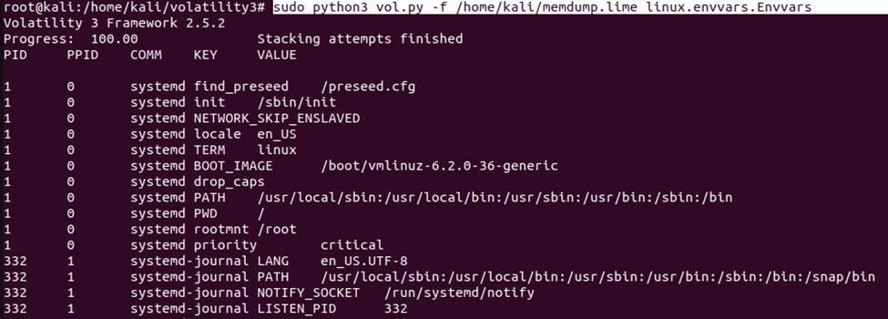

10] IOMem
```sh
$ sudo python3 vol.py -f /home/kali/memdump.lime linux.iomem.IOMem
```
 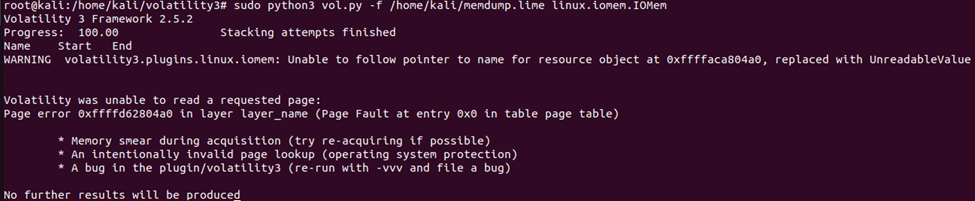


11] Keyboard_Notifiers
```sh
$ sudo python3 vol.py -f /home/kali/memdump.lime linux.keyboard_notifiers.Keyboard_notifiers
``` 

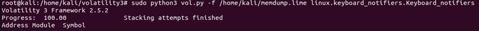


12] KMSG
```sh
$ sudo python3 vol.py -f /home/kali/memdump.lime linux.kmsg.Kmsg
```

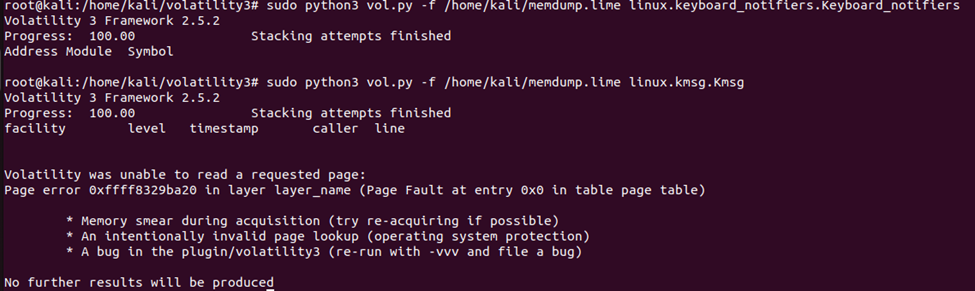


13] Lsmod
```sh
$ sudo python3 vol.py -f /home/kali/memdump.lime linux.lsmod.Lsmod
``` 

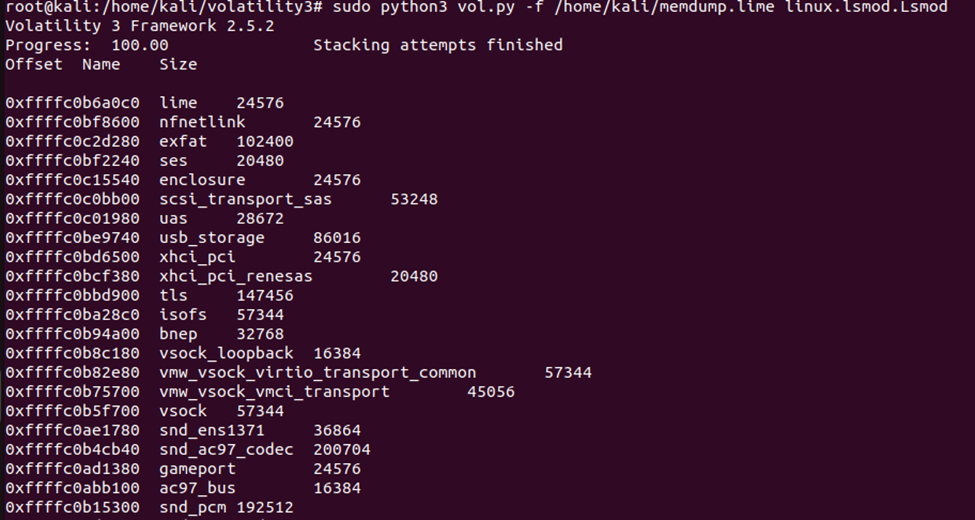


14] Lsof
```sh
$ sudo python3 vol.py -f /home/kali/memdump.lime linux.lsof.Lsof 
```
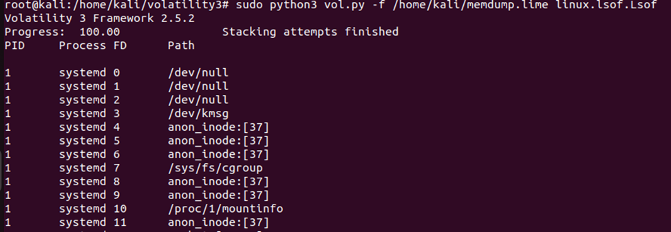

15] Malfind
```sh
$ sudo python3 vol.py -f /home/kali/memdump.lime linux.malfind.Malfind
``` 

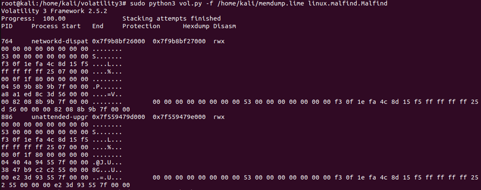


16] Mountinfo
```sh
$ sudo python3 vol.py -f /home/kali/memdump.lime linux.mountinfo.MountInfo
```
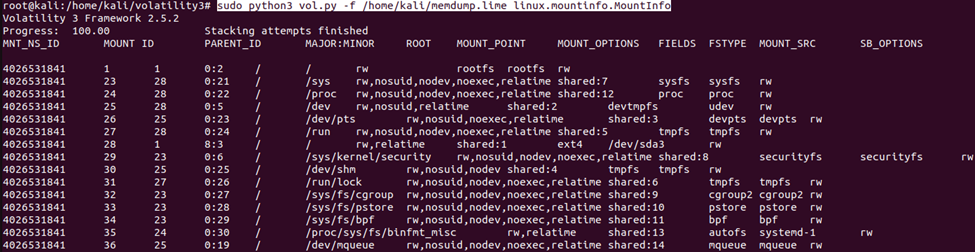
 

17] Proc.Maps
```sh
$ sudo python3 vol.py -f /home/kali/memdump.lime linux.proc.Maps
``` 


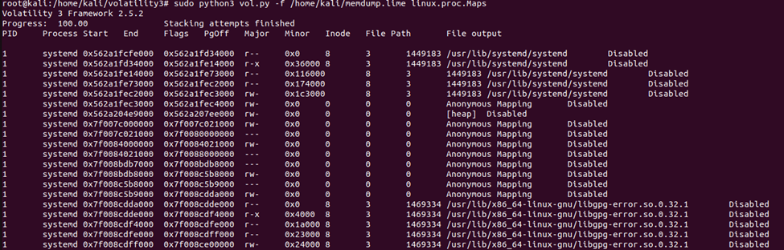


18] Psaux
```sh
$ sudo python3 vol.py -f /home/kali/memdump.lime linux.psaux.PsAux
```

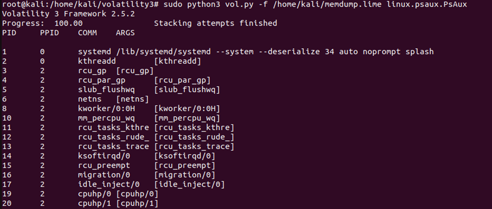


19] Sockstat
```sh
$ sudo python3 vol.py -f /home/kali/memdump.lime linux.sockstat.Sockstat
```

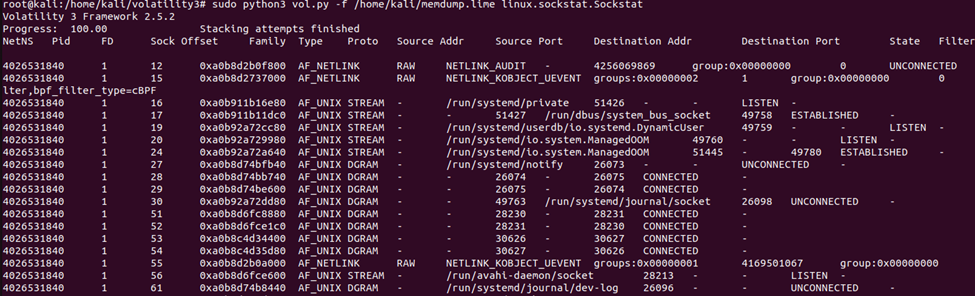


20] tty_check
```sh
$ sudo python3 vol.py -f /home/kali/memdump.lime linux.tty_check.tty_check
``` 

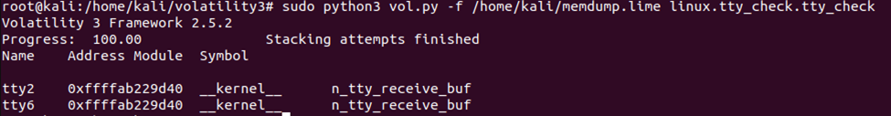


21] frameworkinfo.FrameworkInfo
```sh
$ sudo python3 vol.py -f /home/kali/memdump.lime frameworkinfo.FrameworkInfo
```

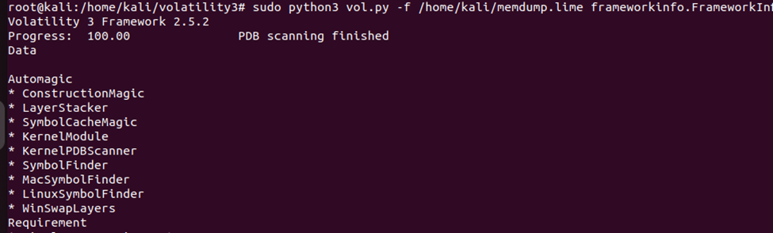


22] isfinfo.IsfInfo
```sh
$ sudo python3 vol.py -f /home/kali/memdump.lime isfinfo.IsfInfo
```

 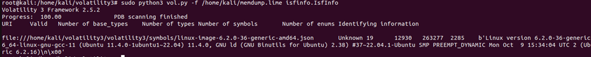


23] layerwriter.LayerWriter
```sh
$ sudo python3 vol.py -f /home/kali/memdump.lime layerwriter.LayerWriter
```

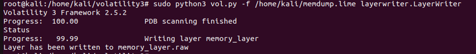


24] Check_afinfo [Didn’t worked]
```sh
$ sudo python3 vol.py -f /home/kali/memdump.lime linux.check_afinfo.Check_afinfo
``` 

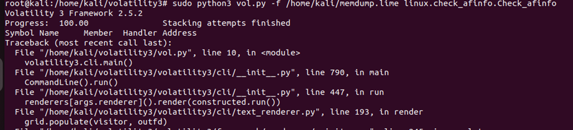


25] Check_creds
```sh
$ sudo python3 vol.py -f /home/kali/memdump.lime linux.check_creds.Check_creds
```

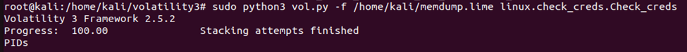


26] Check_idt
```sh
$ sudo python3 vol.py -f /home/kali/memdump.lime linux.check_idt.Check_idt
``` 

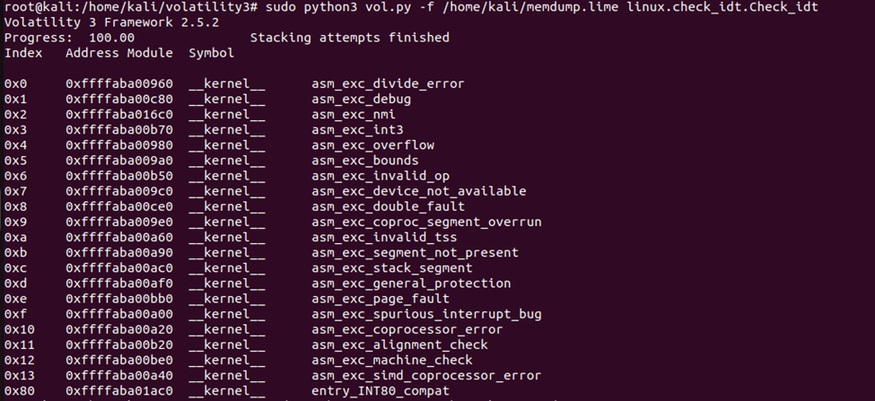


## References:
- https://beguier.eu/nicolas/articles/security-tips-3-volatility-linux-profiles.html
- https://medium.com/@alirezataghikhani1998/build-a-custom-linux-profile-for-volatility3-640afdaf161b
- https://volatility3.readthedocs.io/en/latest/getting-started-linux-tutorial.html
- https://chat.openai.com/


